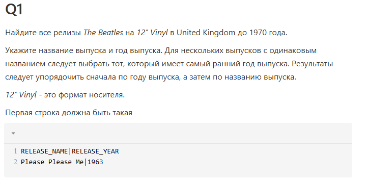
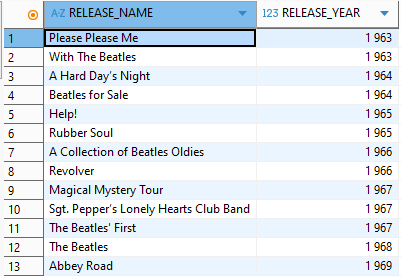
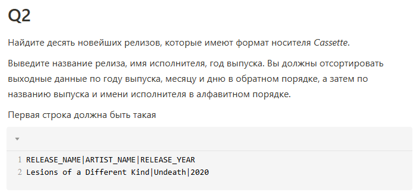
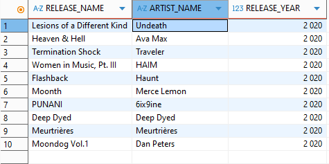
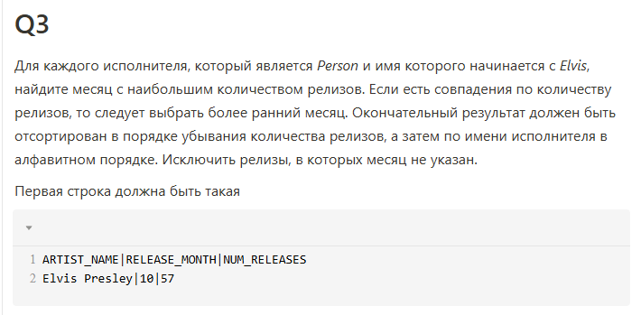
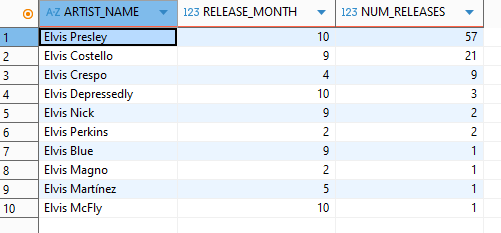
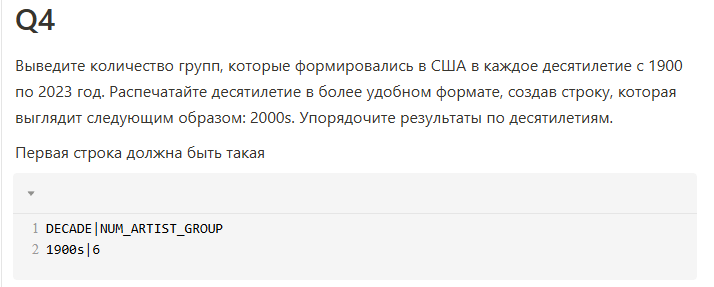
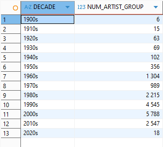
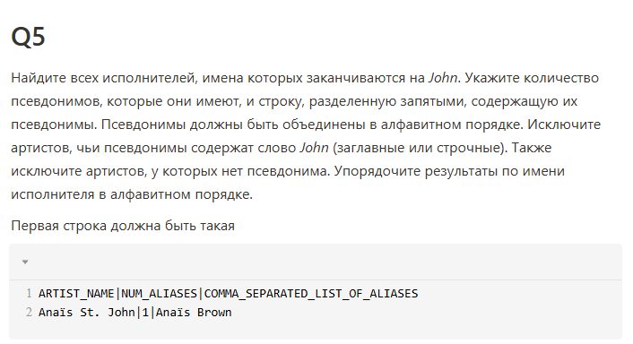
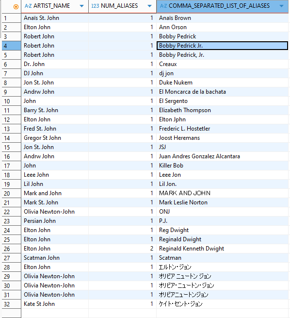

# 🚀 Таска 3 неделя 5

# Задача 1

SQL request:
~~~
WITH earliest_releases AS (
  SELECT
    r.name,
    ri.date_year,
    ROW_NUMBER() OVER (PARTITION BY r.name ORDER BY ri.date_year ASC) AS rn
  FROM release r
    JOIN medium m ON r.id = m.release
    JOIN medium_format mf ON m.format = mf.id
    JOIN release_info ri ON ri.release = r.id
    JOIN area a ON a.id = ri.area
    JOIN artist_credit ac ON ac.id = r.artist_credit
    JOIN artist_credit_name acn ON acn.artist_credit = ac.id
    JOIN artist art ON art.id = acn.artist
  WHERE mf."name" = '12" Vinyl'
    AND a.name = 'United Kingdom'
    AND ri.date_year < 1970
    AND art.name = 'The Beatles'
)
SELECT name as "RELEASE_NAME", date_year as "RELEASE_YEAR"
FROM earliest_releases
WHERE rn = 1
ORDER BY date_year, name;
~~~
SQL response:

--------------------------------------------

# Задача 2

SQL request:
~~~
SELECT 	
    r.name AS "RELEASE_NAME", 
	art.name AS "ARTIST_NAME",	
	ri.date_year AS "RELEASE_YEAR"
FROM release r
    JOIN medium m ON m.release = r.id
    JOIN medium_format mf ON mf.id = m.format
    JOIN release_info ri ON ri.release = r.id
    JOIN artist_credit ac ON ac.id = r.artist_credit
    JOIN artist_credit_name acn ON acn.artist_credit = ac.id
    JOIN artist art ON art.id = acn.artist
WHERE
	mf.name = 'Cassette'
	AND ri.date_year IS NOT NULL
	AND ri.date_month IS NOT NULL
	AND ri.date_day IS NOT NULL
ORDER BY
	ri.date_year DESC,
	ri.date_month DESC,
	ri.date_day DESC,
	r.name ASC,
	art.name ASC
LIMIT 10
~~~
SQL response:

--------------------------------------------

# Задача 3

SQL request:
~~~
WITH releases_per_month AS (
	SELECT art.name AS artist_name, ri.date_month, COUNT(r.id) AS release_count
	FROM artist art
	JOIN artist_type artt ON artt.id = art.TYPE
	JOIN artist_credit_name acn ON acn.artist = art.id
	JOIN artist_credit ac ON ac.id = acn.artist_credit
	JOIN RELEASE r ON r.artist_credit = ac.id
	JOIN release_info ri ON ri.release = r.id 
	WHERE artt.name = 'Person'
	AND art.name LIKE 'Elvis%'
	AND ri.date_month IS NOT NULL
	GROUP BY art.name, ri.date_month
),
ranked_releases AS (
    SELECT artist_name, date_month, release_count,
        ROW_NUMBER() OVER (	
        	PARTITION BY artist_name 
        	ORDER BY release_count DESC, date_month ASC
        ) AS rn
    FROM releases_per_month
)
SELECT artist_name AS "ARTIST_NAME", date_month AS "RELEASE_MONTH", release_count AS "NUM_RELEASES"
FROM ranked_releases
WHERE rn = 1
ORDER BY release_count DESC, artist_name ASC;
~~~
SQL response:

--------------------------------------------

# Задача 4

SQL request:
~~~
SELECT
    CONCAT(((a.begin_date_year / 10) * 10)::text, 's') AS "DECADE",
    COUNT(*) AS "NUM_ARTIST_GROUP"
FROM artist a
  JOIN area ar ON ar.id = a.area
  JOIN artist_type artt ON artt.id = a.type
WHERE ar.name = 'United States'
  AND artt.name = 'Group' 
  AND a.begin_date_year BETWEEN 1900 AND 2023
GROUP BY "DECADE"
ORDER BY "DECADE";
~~~
SQL response:

--------------------------------------------

# Задача 5

SQL request:
~~~
SELECT a.name AS "ARTIST_NAME", count(*) AS "NUM_ALIASES", aa.name AS "COMMA_SEPARATED_LIST_OF_ALIASES"
FROM artist a
  JOIN  artist_alias aa ON aa.artist = a.id
WHERE a.name ilike '%John'
  AND aa.name NOT ILIKE '%John%'
  AND aa.name IS NOT NULL
GROUP BY a.name, aa.name
ORDER BY aa.name
~~~
SQL response:
